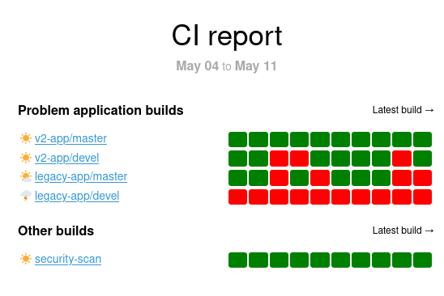

.. _jenkins-plugin:

========
Jenkins
========

The Jenkins plugin provides both a Datasource for querying the Jenkins API, as
well as a View for displaying a summary of job/build statuses. The list of
jobs can be filtered to target jobs that are of interest in your reporting.

Example
========

Configuration
-------------

.. literalinclude:: ../../examples/jenkins.yaml
   :language: yaml

Datasource
==========

.. currentmodule:: kpireport_jenkins.datasource
.. autoclass:: JenkinsDatasource
   :members:
   :show-inheritance:
   :exclude-members: init

Views
=====

Build summary
-------------

.. currentmodule:: kpireport_jenkins.build_summary
.. autoclass:: JenkinsBuildSummary
   :members:
   :show-inheritance:

.. autoclass:: JenkinsBuildFilter
   :members:
