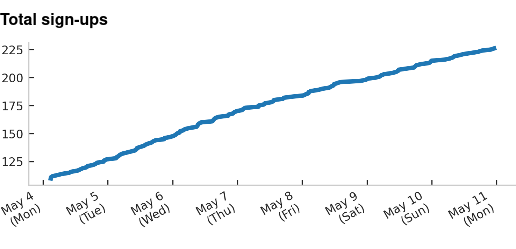
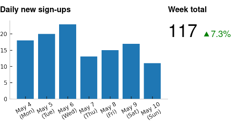

.. _plot-plugin:
.. currentmodule:: kpireport_plot

=====
Plot
=====

The Plot plugin is a simple workhorse plugin for displaying a variety of
timeseries data. It is designed to be compatible with several Datasources and
handle most KPI graphs, which tend to plot only a single metric or perhaps
a set of related metrics.

Sometimes it is useful to only show one number, and a fine-grained trend of
the number is less important; in this case, you can use a "single stat" view,
which is included as part of the Plot plugin for convenience.

.. raw:: html

   

     
<strong>Show/hide example configuration YAML</strong>

.. literalinclude:: ../../examples/mysql.yaml
   :language: yaml

.. raw:: html

   

Views
=====

Plot
----

   A simple line plot from MySQL data

.. autoclass:: Plot
   :members:
   :show-inheritance:

Single stat
-----------

   An example of a plot view combined with a single stat view

.. autoclass:: SingleStat
   :members:
   :show-inheritance:
