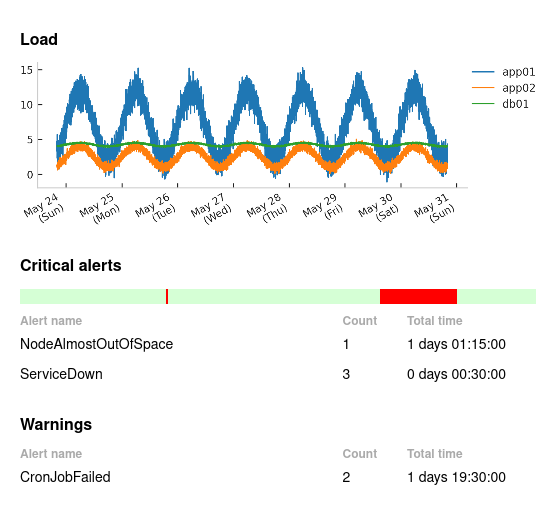

.. _prometheus-plugin:
.. currentmodule:: kpireport_prometheus

===========
Prometheus
===========

The Prometheus plugin provides both a Datasource capable of returning PromQL
query results and a View that summarizes alerts fired by the Prometheus server
over the report interval.

Datasource
==========

.. raw:: html

   

     
<strong>Show/hide example configuration YAML</strong>

.. code-block:: yaml

   datasources:
      prom:
         plugin: prometheus
         args:
            host: prometheus:9090
   views:
      # Using Plot plugin to graph data
      server_load:
         plugin: plot
         title: Load
         args:
            datasource: prom
            query: |
            100 - (avg by(hostname) (irate(node_cpu_seconds_total{mode="idle"}[5m])) * 100

.. raw:: html

   

.. autoclass:: PrometheusDatasource
   :members:
   :show-inheritance:
   :exclude-members: init

Alert summary
=============

.. raw:: html

   

     
<strong>Show/hide example configuration YAML</strong>

.. code-block:: yaml

   critical_alerts:
      plugin: prometheus.alert_summary
      title: Critical alerts
      args:
         datasource: prom
         labels:
            severity: critical
   warning_alerts:
      plugin: prometheus.alert_summary
      title: Warnings
      args:
         datasource: prom
         show_timeline: False
         labels:
            severity: warning

.. raw:: html

   

   An example rendered alert summary. The timeline at the top displays the
   points in time when any alert was firing over the report window.
   Individual alert labels are not shown; the view's purpose is to highlight
   trends or patterns that can be looked at in more detail at the source.

.. autoclass:: PrometheusAlertSummary
   :members:
   :show-inheritance:
